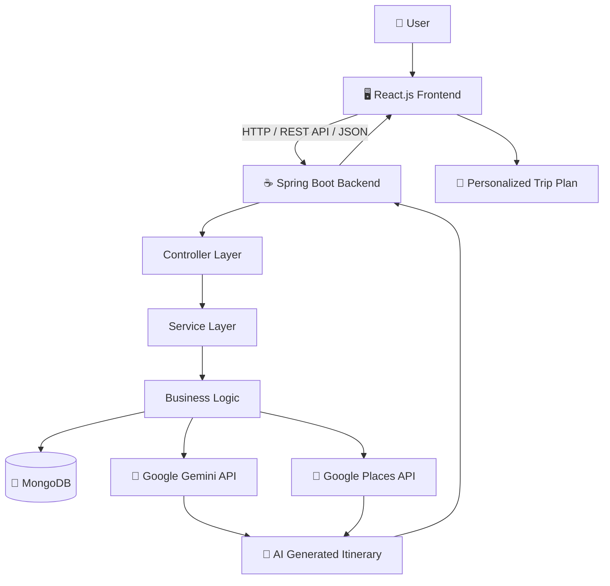
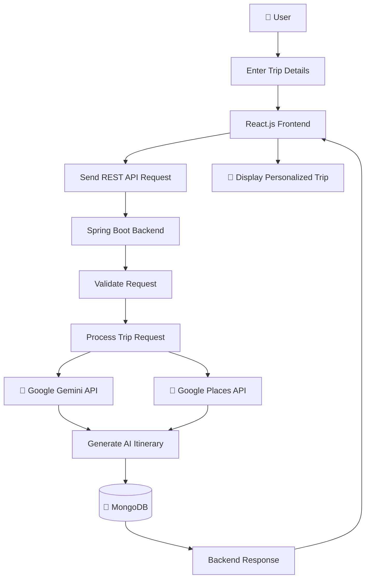
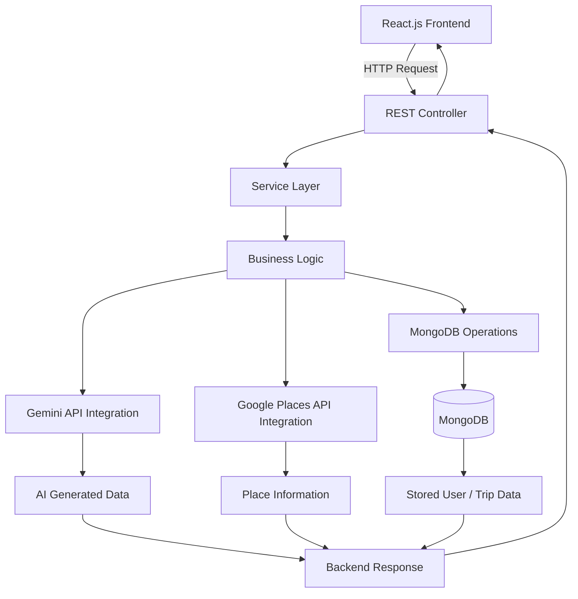
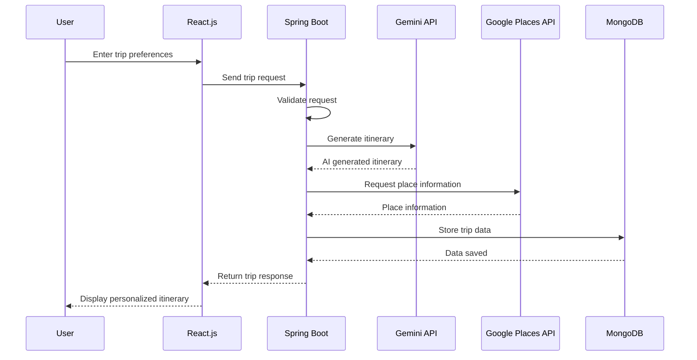

# ✈️ Waypoint — AI Trip Planner

**Waypoint** is a full-stack AI-powered trip planning application that helps users generate personalized travel itineraries based on their destination, budget, trip duration, and travel preferences.

The application combines a **React.js frontend**, **Java Spring Boot backend**, **MongoDB database**, **Google Gemini API**, and **Google Places API** to create a personalized trip-planning experience.

---

## 🌐 Live Demo

🚀 **[View Live Demo](https://ai-based-trip-planner-blush.vercel.app/)**

> **Note:** The current live deployment contains the frontend. The backend and API integrations require local configuration to run the complete application.

## 📂 GitHub Repository

💻 **[View Source Code](https://github.com/prashantmane1207/AI-Based-Trip-Planner)**

---

# 🎯 Project Objective

Planning a trip often requires searching across multiple platforms for destinations, attractions, places to visit, and organizing activities according to a budget and available time.

Waypoint simplifies this process by allowing users to enter their trip preferences and generate a personalized itinerary using AI-powered recommendations and location information.

---

# ✨ Features

- 🤖 AI-powered trip itinerary generation
- 🗺️ Personalized travel planning
- 📅 Day-wise itinerary generation
- 💰 Budget-based trip planning
- 📍 Destination and place information
- 🔎 Google Places API integration
- 🧠 Google Gemini API integration
- 👤 User data management
- 💾 Trip data storage using MongoDB
- 🔗 REST API communication
- 📱 Responsive user interface
- ⚡ React.js based frontend

---

# 🛠️ Tech Stack

## Frontend

| Technology | Purpose |
|---|---|
| React.js | Frontend development |
| JavaScript ES6+ | Application logic |
| HTML5 | Page structure |
| CSS3 | Styling |
| Tailwind CSS | Responsive UI styling |

## Backend

| Technology | Purpose |
|---|---|
| Java | Backend programming |
| Spring Boot | Backend framework |
| Spring REST | REST API development |
| Maven | Dependency management |

## Database

| Technology | Purpose |
|---|---|
| MongoDB | User and trip data storage |

## APIs

| API | Purpose |
|---|---|
| Google Gemini API | AI-powered itinerary generation |
| Google Places API | Place and location information |

## Development Tools

- Git
- GitHub
- Postman
- IntelliJ IDEA
- VS Code

---

# 🏗️ System Architecture



---

# 🔄 Application Workflow



---

# ☕ Backend Architecture



---

# 🔁 Request and Response Flow



---

# 📁 Project Structure

```text
AI-Based-Trip-Planner/
│
├── frontend/
│   │
│   ├── public/
│   │
│   ├── src/
│   │   ├── components/
│   │   ├── pages/
│   │   ├── services/
│   │   └── ...
│   │
│   ├── package.json
│   └── ...
│
├── backend/
│   │
│   ├── src/
│   │   └── main/
│   │       ├── java/
│   │       └── resources/
│   │
│   ├── pom.xml
│   └── ...
│
├── screenshots/
│   ├── home.png
│   ├── trip-output.png
│   ├── mongodb-users.png
│   └── mongodb-trips.png
│
└── README.md
```

> Update this structure if your actual repository uses different folder or package names.

---

# 👨‍💻 My Contribution

This project was developed as a **team project**.

My primary responsibility was the **Java/Spring Boot backend and API integration**.

### Backend Development

- Developed REST APIs using Spring Boot
- Implemented backend request and response handling
- Worked on trip planning business logic
- Integrated Google Gemini API
- Integrated Google Places API
- Implemented request validation
- Added exception handling
- Worked with MongoDB data operations
- Connected backend APIs with the React.js frontend
- Tested APIs using Postman

### Frontend Integration

- Worked on connecting React.js frontend with Spring Boot REST APIs
- Handled JSON request and response data
- Assisted with frontend-backend integration

---


# 🚀 Getting Started

Follow these steps to run the project locally.

---

## 📋 Prerequisites

Make sure you have the following installed:

- Java 17 or later
- Maven
- Node.js
- npm
- MongoDB
- Git

---

# 1️⃣ Clone the Repository

```bash
git clone https://github.com/prashantmane1207/AI-Based-Trip-Planner.git
```

Navigate into the project:

```bash
cd AI-Based-Trip-Planner
```

---

# 2️⃣ Backend Setup

Navigate to the backend folder:

```bash
cd backend
```

Build the Spring Boot project:

```bash
mvn clean install
```

Run the backend:

```bash
mvn spring-boot:run
```

The Spring Boot backend will start on the configured port.

---

# 3️⃣ Frontend Setup

Open another terminal.

Navigate to the frontend folder:

```bash
cd frontend
```

Install dependencies:

```bash
npm install
```

Start the React application:

```bash
npm start
```

The frontend will start on the configured local development port.

---

# 🔐 Environment Variables

The application requires API credentials for external services.

**Never commit API keys or passwords to GitHub.**

Example configuration:

```properties
GEMINI_API_KEY=your_gemini_api_key
GOOGLE_PLACES_API_KEY=your_google_places_api_key
MONGODB_URI=your_mongodb_connection_string
```

Use your actual project configuration method for these variables.

---

## ⚠️ Security

Do not upload sensitive information such as:

```text
.env
API keys
Passwords
Database credentials
Secret tokens
Private configuration files
```

Add sensitive files to `.gitignore`.

Example:

```gitignore
.env
*.env
application-secret.properties
```

---

# 🧪 API Testing

Backend REST APIs can be tested using **Postman**.

Typical flow:

```text
React.js
    ↓
REST API Request
    ↓
Spring Boot Controller
    ↓
Service Layer
    ↓
External APIs / MongoDB
    ↓
REST API Response
    ↓
React.js
```

---

# 📚 Learning Outcomes

This project provided practical experience in:

- Java backend development
- Spring Boot
- REST API development
- API integration
- JSON request and response handling
- MongoDB database operations
- React.js integration
- Request validation
- Exception handling
- Postman API testing
- Git and GitHub
- Frontend-backend communication
- Team-based project development

---

# 🔮 Future Enhancements

Possible future improvements include:

- 🌦️ Weather API integration
- 🗺️ Interactive maps
- 🛣️ Route visualization
- 💰 Detailed trip budget breakdown
- 🏨 Hotel recommendations
- ✈️ Flight information
- 📱 Mobile application
- 🔔 Trip reminders
- 🎯 Improved AI personalization

---

# 🤝 Team Project

Waypoint was developed collaboratively as a team project.

Different team members contributed to areas such as:

- Frontend development
- Backend development
- API integration
- Database management
- Application integration

---

# 👨‍💻 Developer

## Prashant Mane

**Aspiring Software Developer**

Java | Spring Boot | React.js | SQL | REST APIs | Hibernate

📧 **Email:** prashantmane1207@gmail.com

💻 **GitHub:**  
https://github.com/prashantmane1207

🔗 **LinkedIn:**  
https://www.linkedin.com/in/prashant-mane-0b125b31b/
