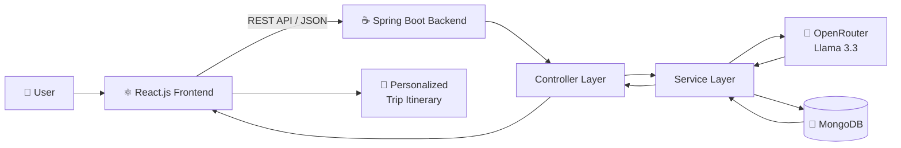
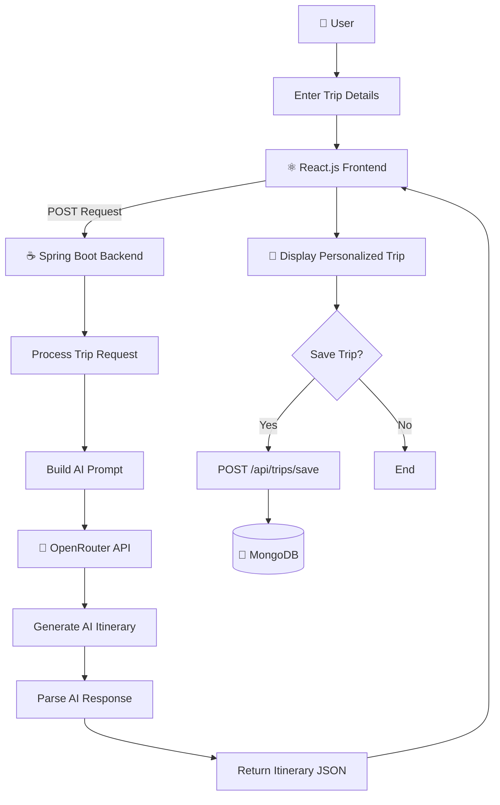
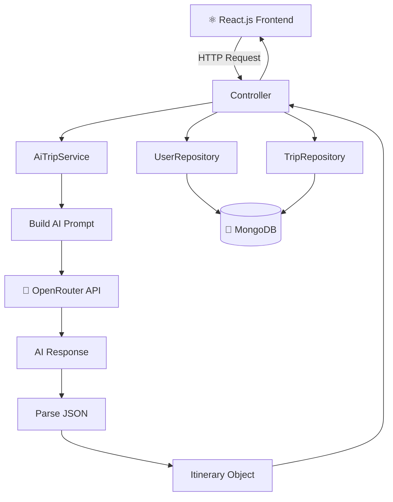
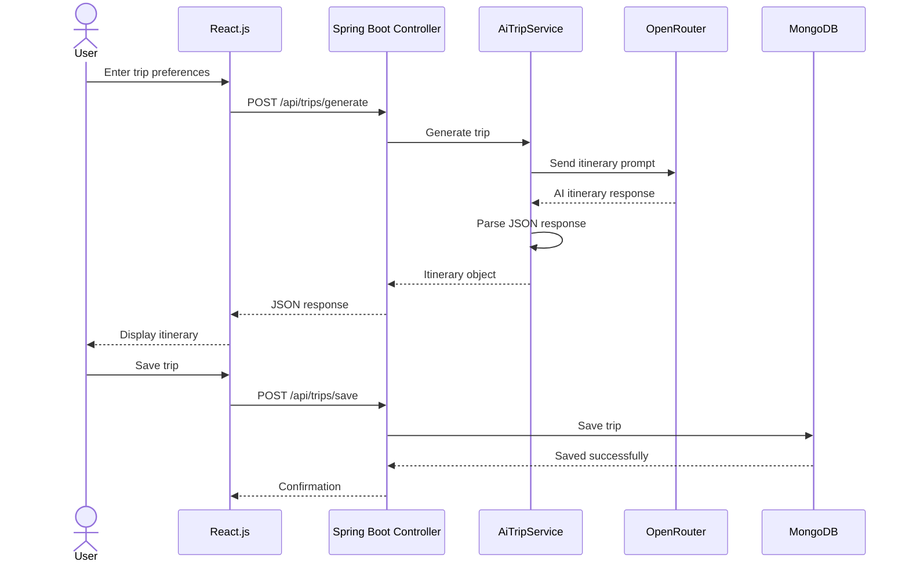

# ✈️ Waypoint — AI Trip Planner

Waypoint is a full-stack AI-powered trip planning application that generates personalized travel itineraries based on the user's destination, budget, trip duration, and travel preferences.

## 🌐 Live Demo

[View Live Demo](https://ai-based-trip-planner-blush.vercel.app/)

## 📂 Source Code

[View on GitHub](https://github.com/prashantmane1207/AI-Based-Trip-Planner)

---

## ✨ Features

* 🤖 AI-powered trip itinerary generation using OpenRouter and Llama 3.3
* 🗺️ Personalized travel planning
* 📅 Day-wise itinerary with hotels and activities
* 💰 Budget-based trip planning
* 👤 User signup and login
* 💾 Trip storage using MongoDB
* 🔗 REST API communication between React.js and Spring Boot
* 📍 Interactive map display
* 📱 Responsive user interface

---

## 🛠️ Tech Stack

| Category        | Technologies                                       |
| --------------- | -------------------------------------------------- |
| Frontend        | React.js, JavaScript, HTML5, CSS3, Tailwind CSS    |
| Maps            | Leaflet, React Leaflet, Google Maps JavaScript SDK |
| Backend         | Java 17, Spring Boot 3.2, Spring Web               |
| Database        | MongoDB                                            |
| Database Access | Spring Data MongoDB                                |
| AI              | OpenRouter, Llama 3.3 70B Instruct                 |
| Build Tool      | Maven                                              |
| API Testing     | Postman                                            |
| Development     | IntelliJ IDEA, VS Code                             |
| Version Control | Git, GitHub                                        |

---

## 🏗️ System Architecture



---

## 🔄 Application Workflow



---

## ☕ Backend Architecture



---

## 🔁 API Request Flow



---

## 📁 Project Structure

```text
AI-Based-Trip-Planner/
│
├── frontend/
│   ├── public/
│   ├── src/
│   │   ├── components/
│   │   │   ├── PlanTrip
│   │   │   ├── TripResult
│   │   │   ├── MapSection
│   │   │   ├── MapComponent
│   │   │   ├── Home
│   │   │   ├── Login
│   │   │   ├── Signup
│   │   │   └── MyTrips
│   │   │
│   │   ├── service/
│   │   │   └── api.js
│   │   │
│   │   └── ...
│   │
│   ├── package.json
│   └── ...
│
├── backend/
│   ├── src/
│   │   ├── main/
│   │   │   ├── java/
│   │   │   │   └── com/aitrip/backend/
│   │   │   │       ├── AiTripApplication.java
│   │   │   │       ├── config/
│   │   │   │       │   └── WebConfig.java
│   │   │   │       ├── controller/
│   │   │   │       │   └── AiTripController.java
│   │   │   │       ├── service/
│   │   │   │       │   └── AiTripService.java
│   │   │   │       ├── model/
│   │   │   │       │   ├── User.java
│   │   │   │       │   ├── Trip.java
│   │   │   │       │   └── Itinerary.java
│   │   │   │       └── repository/
│   │   │   │           ├── UserRepository.java
│   │   │   │           ├── TripRepository.java
│   │   │   │           └── ItineraryRepository.java
│   │   │   │
│   │   │   └── resources/
│   │   │       └── application.properties
│   │   │
│   │   └── test/
│   │
│   ├── pom.xml
│   └── ...
│
├── Home.png
├── Output1.png
├── Output2.png
├── Output3.png
└── README.md
```

---

## 👨‍💻 My Contribution

This project was developed as a team project. My primary responsibility was the **Java/Spring Boot backend and frontend integration**.

### Backend Development

* Developed REST APIs using Spring Boot
* Implemented trip generation, saving, and retrieval
* Developed trip-planning business logic
* Built prompts for AI itinerary generation
* Integrated OpenRouter API with Llama 3.3
* Implemented MongoDB operations using Spring Data MongoDB
* Configured CORS
* Implemented basic exception handling
* Tested REST APIs using Postman

### Frontend Integration

* Connected React.js frontend with Spring Boot REST APIs
* Implemented JSON request and response handling
* Integrated frontend trip-planning functionality with backend APIs

---

## 🚀 Getting Started

### Prerequisites

Make sure the following are installed:

* Java 17+
* Maven
* Node.js
* npm
* MongoDB
* Git

### 1. Clone Repository

```bash
git clone https://github.com/prashantmane1207/AI-Based-Trip-Planner.git
cd AI-Based-Trip-Planner
```

### 2. Backend Setup

```bash
cd backend
mvn clean install
mvn spring-boot:run
```

Backend:

```text
http://localhost:8081
```

### 3. Frontend Setup

Open another terminal:

```bash
cd frontend
npm install
npm run dev
```

Frontend:

```text
http://localhost:5173
```

---

## 🔐 Configuration

Configure the following properties in:

```text
backend/src/main/resources/application.properties
```

```properties
openrouter.api-key=YOUR_OPENROUTER_API_KEY
server.port=8081
spring.data.mongodb.uri=mongodb://localhost:27017/aitrip
```

> Never commit real API keys or database credentials to GitHub.

---

## 🧪 REST API Endpoints

| Endpoint                   | Method | Description            |
| -------------------------- | ------ | ---------------------- |
| `/api/auth/signup`         | POST   | Create a new user      |
| `/api/auth/login`          | POST   | User login             |
| `/api/trips/generate`      | POST   | Generate AI itinerary  |
| `/api/trips/save`          | POST   | Save a trip            |
| `/api/trips/user/{userId}` | GET    | Get user's saved trips |

### Example API Flow

```text
React.js
    │
    ▼
REST API Request
    │
    ▼
Spring Boot Controller
    │
    ▼
AiTripService
    │
    ├──────────────► OpenRouter API
    │                      │
    │                      ▼
    │               AI Itinerary
    │
    └──────────────► MongoDB
                           │
                           ▼
                     Saved Trip
    │
    ▼
JSON Response
    │
    ▼
React.js
```

---

## 📚 Learning Outcomes

* Java backend development with Spring Boot
* REST API development
* AI API integration
* JSON request and response handling
* MongoDB database operations
* React.js and Spring Boot integration
* Postman API testing
* Git and GitHub
* Team-based software development

---

## 👨‍💻 Developer

### Prashant Mane

**Aspiring Software Developer**

`Java` · `Spring Boot` · `React.js` · `MongoDB` · `REST APIs`

📧 [prashantmane1207@gmail.com](mailto:prashantmane1207@gmail.com)

💻 [GitHub](https://github.com/prashantmane1207)

🔗 [LinkedIn](https://www.linkedin.com/in/prashant-mane-0b125b31b/)
